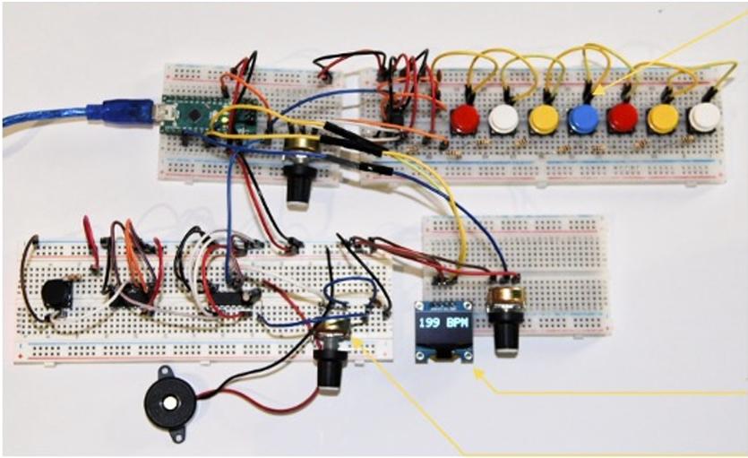

## Projet d'Electronique du 2nd semestre ECE ING1

***Objectif :** *Reproduire un Synthé sur Arduino avec une interface graphique Processing

***Rendu :*** Rapport détaillé et professionnel et Projet Arduino 

---

***Organisation :***

Fichiers du Projet sur GitHub +

Rapport + Présentation ---> [Dossier Google Drive](https://drive.google.com/drive/folders/18Ejd3RK-yX-xevtI5TjwW3On4UCgQXpG?usp=sharing "redirection vers Drive")

---

**1 - Conception du circuit**

Circuit sous forme :

