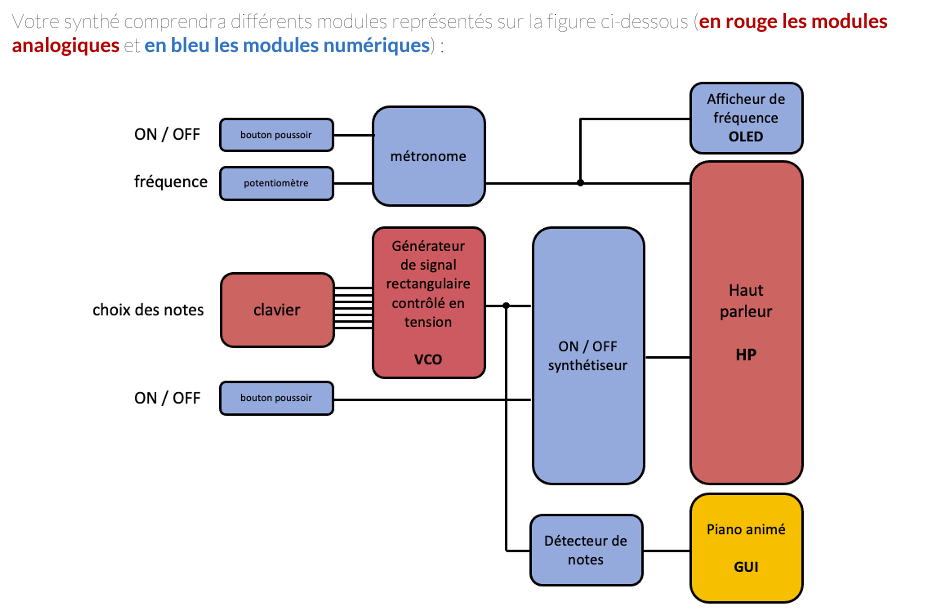

## Projet d'Electronique du 2nd semestre  - ECE ING1

***Objectif :*** Reproduire un Synthé sur Arduino avec une interface graphique Processing

***Rendu :*** Rapport détaillé et professionnel + clip vidéo

***Deadline de rendu du rapport :*** Dimanche 16 avril 23:55

***Semaine du 17 avril :*** Soutenances de projet ( Le projet doit être fonctionnel)

***Semaine du 24 avril :*** dimanche 30 avril 23:55

---

***Organisation :***

* Fichiers du Projet sur GitHub
* Rapport + Présentation --> [Dossier Google Drive](https://drive.google.com/drive/folders/18Ejd3RK-yX-xevtI5TjwW3On4UCgQXpG?usp=sharing "redirection vers Drive")

# 1 - Conception du circuit

* Diagramme synoptique des différents modules numériques et analogiques :

  
* ***Forme finale supposée du circuit :***
* 
